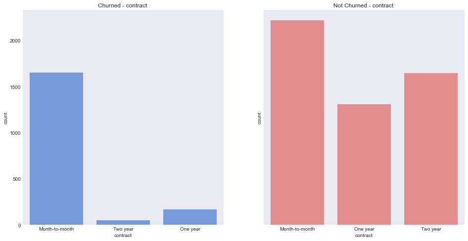
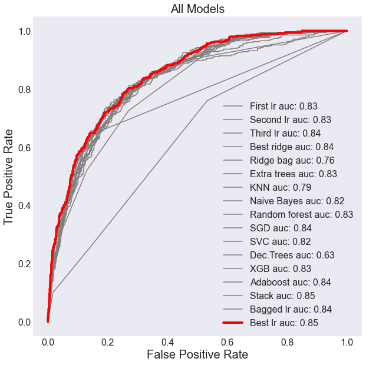
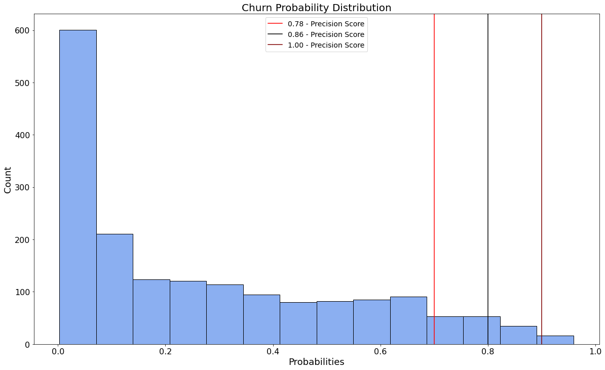

# Telco Customer Data

## Overview
The focus of this project was to predict if a customer will churn and to find out what the likelihood of that is for each customer. The analysis of this company has allowed for a model to be made to predict churn of the customers and the likelihood along with a recommendation to the business to reduce this likelihood. This model can be used by Telco to make better informed decisions on where to allocate customer retention resources and reduce losses in revenue from lost customers.
 
## Business Problem
Telco would like to be able to predict whether a customer has a high likelihood of dropping their services and which customers they need to spend more resources on to keep and which ones require the most resources to retain.

## Data
The data was collected from a Kaggle dataset titled "Telco Customer Churn". It has 21 columns of customer data that is used to predict customer churn. This data was used to create a model to predict if a customer will churn and the percent risk they are to churn. This data was also used to feature engineer new columns that would be more useful for prediction. The data was used to create informative visuals.

### Source
The columns used for prediction were:

1. Gender (gender of the customer), 
2. SeniorCitizen (whether the customer is a senior citizen), 
3. Partner (whether the customer is married), 
4. Dependents (whether the customer has children), 
5. Tenure (the number of months the customer has been with the company), 
6. PhoneService (whether the customer uses the company for phone service), 
7. MultipleLines (whether the customer has multiple phone lines), 
8. InternetService (whether the customer uses the company for internet service), 
9. OnlineSecurity (whether the customer uses the online security service), 
10. OnlineBackup (whether the customer uses the online backup service), 
11. DeviceProtection (whether the customer uses the device protection service), 
12. TechSupport (whether the customer uses the tech support service), 
13. StreamingTV (whether the customer uses the TV streaming service), 
14. StreamingMovies (whether the customer uses the movie streaming service), 
15. Contract (whether the customer is on a month-to-month, one year, or two year contract), 
16. PayperlessBilling (whether the customer uses payperless billing), 
17. PaymentMethod (whether the customer pays by electronic check, mailed check, automatic bank transfer, or credit card), 
18. MonthlyCharges (The amount the customer is charged each month), 
19. TotalCharges (the total amount the customer has been charged), and 
20. Churn (whether the customer has discontinued use of the company in the past month (the target variable)).

Engineered features include:

21. totchg_per_tenure (the amount of the total charge divided by the customer's tenure), 
22. monthly_div_tot (the customer's monthly charges divided by their total charges), 
23. single_parent (if the customer has a dependent but does not have a partner), 
24. phone_and_internet (if the customer uses the company for phone and internet service), 
25. num_of_internet_services (the number of additional internet services the customer uses), and 
26. num_of_services (the number of total additional services the customer uses).
    
## Process

After getting the data, we took the time to explore the features. In the EDA notebook, we identified problems with the data so that they could be handled during preprocessing.

Next, I preprocessed the data by identifying column types and making lists of each column name. Then, I could apply encoding, scaling, or imputing as appropriate. Finally, we plotted each variable against churn and not churn. An example plot is below. It shows contract type for churn or not churn.

After looking at the data and getting familiar with the processing that we needed, I made a new notebook called Initial Processing. In this notebook, I made train, validation, and testing data sets. Next, I setup a process for imputing missing data, encoding categorical data, and scaling numerical data. Finally, Each new dataset was saved to a csv so that Griffin and I could easily work from the same data.

Griffin and I started modeling with logistic regressions and we independently tuned them to optimize precision. We tried many models including, gradient decent and boosting models, tree models, and support vector machines. We plotted receiver operating characteristic (ROC) curves and calculated the area under the curve (AUC) for each model. The graph below shows all models that we tried.

We decided to go with our best logistic regression because it had an AUC score of 0.85. It was also simple, effective, and the most interpretable.

## Findings

Our final model had an AUC score of 0.83 on the testing data and all features had non-zero importance. We were also able to predict the chance of each customer churning and find the precision score for different quantiles. The graph below shows this. The score for customers with a 70% chance to churn and above is 0.78.

## Recommendations

We recommend that Telco focus on customers who are most likely to churn. They might provide discounts or coupons to these customers. Additionally, Telco should try to sell longer contract terms and market those to people who are likely to churn. Telco could also raise the price of month-to-month contracts to make longer term ones more enticing.

'''
project-folder
    |
    TelcoDataAnalysis.pdf
    README.md
    data
    images
    models
    notebooks
          |
          EDA.ipynb
          Final Model.ipynb
          Initial Processing.ipynb
          Model Roc Auc.ipynb
          Modeling.ipynb
          exploratory-folder
                  |
                  Griffin
                  Warren
'''             
