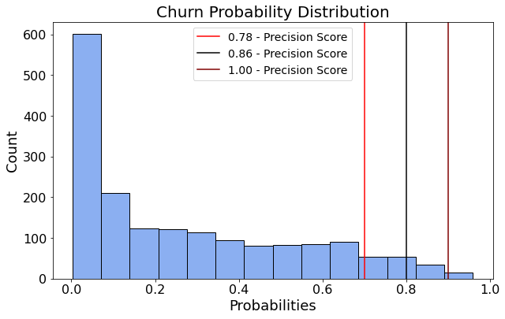

# Telco Customer Data
 briefly covers your process, methodology and findings.

    Take the time to make sure that you craft your story well, and clearly explain your process and findings in a way that shows both your technical expertise and your ability to communicate your results!
    Begin with framing questions, describe your data source, include relevant, well labeled visualizations that support your conclusions, which come at the end.
    
## Business Problem

Telco needs help identifiying customers who might churn (drop their service) in the next month. We will produce models to predict customer churn with as much precision as is reasonable. Telco has limited resources so they need to know the best way to focus their attention.
    
    
## Data
wher it came from
### Source
explaination of columns
distrobutions
    
## Process

After getting the data, we took the time to explore the features. In the EDA notebook, we identified problems with the data so that they could be handled during preprocessing.

Next, I preprocessed the data by identifying column types and making lists of each column name. Then, I could apply encoding, scaling, or imputing as appropriate. Finally, we plotted each variable against churn and not churn. An example plot is below. It shows contract type for churn or not churn.

After looking at the data and getting familiar with the processing that we needed, I made a new notebook called Initial Processing. In this notebook, I made train, validation, and testing data sets. Next, I setup a process for imputing missing data, encoding categorical data, and scaling numerical data. Finally, Each new dataset was saved to a csv so that Griffin and I could easily work from the same data.

Griffin and I started modeling with logistic regressions and we independently tuned them to optimize precision. We tried many models including, gradient decent and boosting models, tree models, and support vector machines. We plotted receiver operating characteristic (ROC) curves and calculated the area under the curve (AUC) for each model. The graph below shows all models that we tried.

We decided to go with our best logistic regression because it was simple, effective, and the most interpretable.

## Findings

Our final model had an AUC score of 0.83 on the testing data and all features had non-zero importance. We were also able to predict the chance of each customer churning and find the precision score for different quantiles. The graph below shows this. The score for customers with a 70% chance to churn and above is 0.78.

## Recommendations

We recommend that Telco focus on customers who are most likely to churn. They might provide discounts or coupons to these customers. Additionally, Telco should try to sell longer contract terms and market those to people who are likely to churn. Telco could also raise the price of month-to-month contracts to make longer term ones more enticing. 